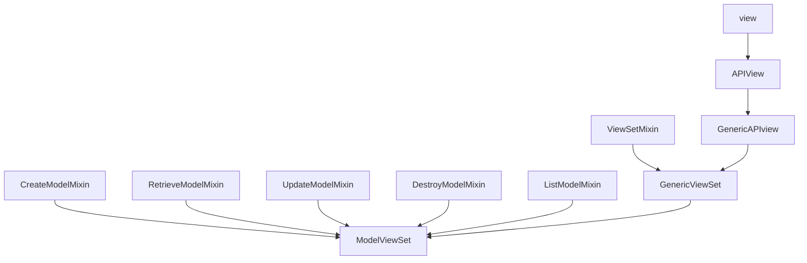

# view类继承关系图

```mermaid
graph TB
	view --> APIView
	APIView --> GenericAPIview
	
	ViewSetMixin --> GenericViewSet
	GenericAPIview -->　GenericViewSet
	
	CreateModelMixin --> ModelViewSet
	RetrieveModelMixin --> ModelViewSet
	UpdateModelMixin --> ModelViewSet
	DestroyModelMixin --> ModelViewSet
	ListModelMixin --> ModelViewSet
	GenericViewSet --> ModelViewSet
```

