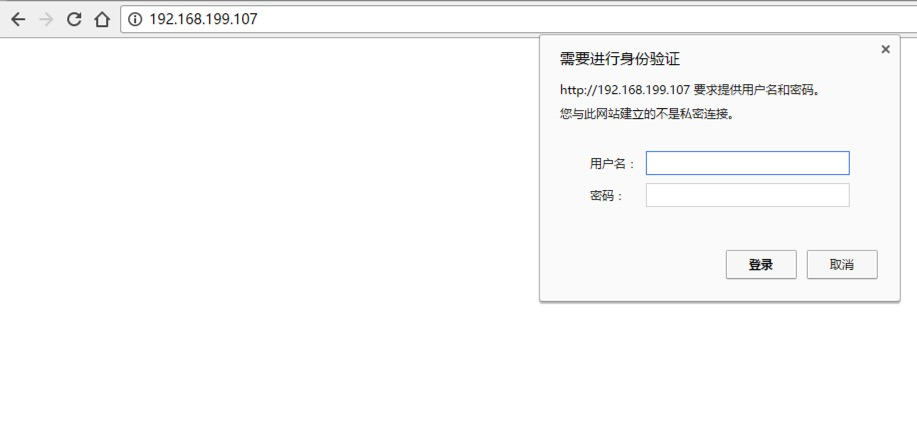

# 密码管理类

## HTTPPasswordMgrWithDefaultRealm()

- HTTPPasswordMgrWithDefaultRealm()类将创建一个密码管理对象，用来保存 HTTP 请求相关的授权信息（用户名和密码），主要应用两个场景：
  - 验证代理授权的用户名和密码 (ProxyBasicAuthHandler())
  - 验证Web客户端的的用户名和密码 (HTTPBasicAuthHandler())

## ProxyBasicAuthHandler(代理授权验证)

- 如果我们使用之前的代码来使用私密代理，会报 HTTP 407 错误，表示代理没有通过身份验证：
    `urllib.request.HTTPError: HTTP Error 407: Proxy Authentication Required`

- 所以我们需要改写代码，通过：
  - HTTPPasswordMgrWithDefaultRealm()：来保存私密代理的用户密码
  - ProxyBasicAuthHandler()：来处理代理的身份验证。

```python
from urllib import request

# 私密代理授权的账户
user = "mr_mao_hacker"
# 私密代理授权的密码
passwd = "sffqry9r"
# 私密代理 IP
proxyserver = "61.158.163.130:16816"

# 1. 构建一个密码管理对象，用来保存需要处理的用户名和密码
passwdmgr = request.HTTPPasswordMgrWithDefaultRealm()

# 2. 添加账户信息，第一个参数realm是与远程服务器相关的域信息，一般没人管它都是写None，后面三个参数分别是 代理服务器、用户名、密码
passwdmgr.add_password(None, proxyserver, user, passwd)

# 3. 构建一个代理基础用户名/密码验证的ProxyBasicAuthHandler处理器对象，参数是创建的密码管理对象
#   注意，这里不再使用普通ProxyHandler类了
proxyauth_handler = request.ProxyBasicAuthHandler(passwdmgr)

# 4. 通过 build_opener()方法使用这些代理Handler对象，创建自定义opener对象，参数包括构建的 proxy_handler 和 proxyauth_handler
opener = request.build_opener(proxyauth_handler)

# 5. 构造Request 请求
request = request.Request("http://www.baidu.com/")

# 6. 使用自定义opener发送请求
response = opener.open(request)

# 7. 打印响应内容
print(response.read())
```

## HTTPBasicAuthHandler处理器（Web客户端授权验证）

- 

- 有些Web服务器（包括HTTP/FTP等）访问时，需要进行用户身份验证，爬虫直接访问会报HTTP 401 错误，表示访问身份未经授权：`urllib.request.HTTPError: HTTP Error 401: Unauthorized`

- 如果我们有客户端的用户名和密码，我们可以通过下面的方法去访问爬取：

```python
from urllib import request

# 用户名
user = "test"
# 密码
passwd = "123456"
# Web服务器 IP
webserver = "http://192.168.199.107"

# 1. 构建一个密码管理对象，用来保存需要处理的用户名和密码
passwdmgr = request.HTTPPasswordMgrWithDefaultRealm()

# 2. 添加账户信息，第一个参数realm是与远程服务器相关的域信息，一般没人管它都是写None，后面三个参数分别是 Web服务器、用户名、密码
passwdmgr.add_password(None, webserver, user, passwd)

# 3. 构建一个HTTP基础用户名/密码验证的HTTPBasicAuthHandler处理器对象，参数是创建的密码管理对象
httpauth_handler = request.HTTPBasicAuthHandler(passwdmgr)

# 4. 通过 build_opener()方法使用这些代理Handler对象，创建自定义opener对象，参数包括构建的 proxy_handler
opener = request.build_opener(httpauth_handler)

# 5. 可以选择通过install_opener()方法定义opener为全局opener
request.install_opener(opener)

# 6. 构建 Request对象
request = request.Request("http://192.168.199.107")

# 7. 定义opener为全局opener后，可直接使用urlopen()发送请求
response = request.urlopen(request)

# 8. 打印响应内容
print(response.read())
```