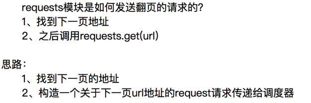

# `Scrapy 中 Spiders部分`

- 

- 

## `Scrapy`爬虫提取数据

- 在scrapy项目的爬虫文件中，想要提取response中的数据需要对xpath的返回结果进行提取
- 一般是使用 `extract()`方法，然后取第一个值（因为xpath的返回结果是一个列表）
- 但是这种方法存在的一个问题是，当 xpath 的返回结果没有数据时，使用 `extract()`方法提取会报错
- 改进方法：
  1. 在取数据之前对 xpath 的返回结果进行判断，如果为空则返回空（没法获取到第一个值，因为没有啊）
  2. 使用 `extract_first()`方法，该方法作用是提取 xpath 返回列表的第一个值，如果列表为空则返回`None`

# 从选择器中提取字符串

- `extract()` 返回一个包含字符串数据的列表
- `extract_first()`返回列表中的第一个字符串

## 实现翻页请求

- 

- 

  ## `scrapy.Request`

- 

  ## spider 多个解析函数之间传递数据

  - 使用 `scrapy.Request()`方法中的 `meta` 参数， 该参数为字典
  - 在调用的回掉函数中，使用 `response.meta['key']` 取出传入数据内容
  - 