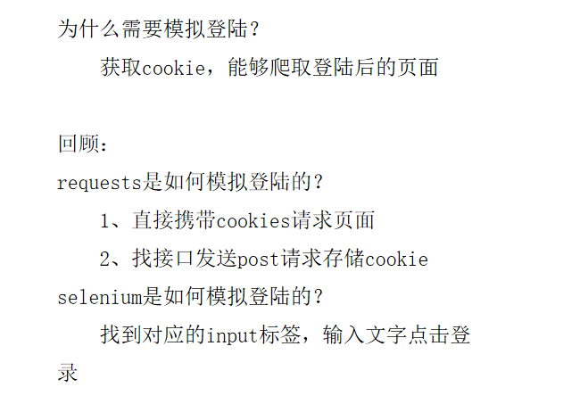
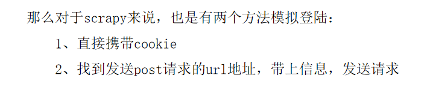
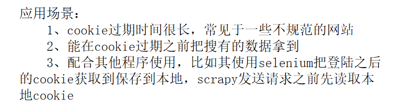

# scrapy模拟登录

- 模拟登陆时，必须保证settings.py里的 COOKIES_ENABLED (Cookies中间件) 处于开启状态，
- COOKIES_ENABLED = True 或 # COOKIES_ENABLED = False，使用Scrapy模拟登陆简单易懂，可以说能处理大部分的登录操作。
- COOKIES_ENABLE 默认就是开启状态。
- 在 `settings.py`文件中设置 `COOKIES_DEBUG = True` 可以看到服务器和爬虫交互的cookie信息

## 1. 直接POST数据到登录提交的url地址

- 适用于提交 post 数据的情况

- 以“人人网”为例：

  1. 分析人人网登录页面`http://www.renren.com/`，发现页面提交的url地址为`http://www.renren.com/PLogin.do`
  2. 提交form数据向这个url
  3. 开启 COOKIES_ENABLE
  4. 运行爬虫

  ```python
  # -*- coding: utf-8 -*-
  """
  1. 直接POST数据到登录提交的url地址
  使用这种方式要开启 COOKIES_ENABLE
  """
  
  import scrapy
  
  
  class Renren1Spider(scrapy.Spider):
      name = 'renren1'
      allowed_domains = ['renren.com']
      # start_urls = ['http://renren.com/']
  
      # def parse(self, response):
      #     pass
  
      def start_requests(self):
          """
          重写start_requests，按照需要来发送请求
          """
          url = "http://www.renren.com/PLogin.do"
          data = {
              "email": "13193820382",
              "password": "xxxxxxxx",
          }
  
          yield scrapy.FormRequest(
              url=url,
              formdata=data,
              callback=self.parse_page
          )
  
      def parse_page(self, response):
          """
          处理登录后的response文件
          """
          with open("./file/renren1.html", 'w', encoding="utf-8") as f:
              f.write(response.body.decode())
  ```

## 2. 正规模拟登录步骤

1. 首先发送登录页面的get请求，获取到页面里的登录必须的参数（比如说登陆界面的一些hidden数据）
2. 然后和账户密码一起post到服务器。

```python

# -*- coding: utf-8 -*-
import scrapy


class Renren2Spider(scrapy.Spider):
    name = 'renren2'
    allowed_domains = ['renren.com']
    start_urls = ['http://www.renren.com/']

    def parse(self, response):
        """
        通过登录页面的response，发送POST数据
        """
        data = {
            "email": "13193820382",
            "password": "XXXXXXXXX",
        }

        yield scrapy.FormRequest.from_response(response, formdata=data, callback=self.parse_page)

    def parse_page(self, response):
        """
        登录成功后，进入个人主页
        """
        url = "http://www.renren.com/968608156/profile"
        yield scrapy.Request(url, callback=self.parse_profile)

    def parse_profile(self, response):
        """
        个人主页写入文件
        """
        with open("./file/renren2.html", 'w', encoding="utf-8") as f:
            f.write(response.body.decode())

```

### 注意：当一个页面有多个`from` 表单时怎么办？

-  `scrapy.FormRequest.from_response()`方法内还有一些其他参数可以帮助我们定位需要使用的 `from`表单

- ```python
  def from_response(cls, response, formname=None, formid=None, formnumber=0, formdata=None,
                        clickdata=None, dont_click=False, formxpath=None, formcss=None, **kwargs):
  ```

  

```python

```

## 3. 使用登录后的Cookie模拟登录

```python
# -*- coding: utf-8 -*-
import scrapy


class Renren3Spider(scrapy.Spider):
    name = 'renren3'
    allowed_domains = ['renren.com']
    start_urls = ['http://www.renren.com/968608156/profile']

    cookies = {
        "anonymid": "jo6sr79k40ag06", " _r01_": "1",
        " jebe_key": "677bb307-0e02-4841-bef6-440071dd690f%7C7471263abebbaff7e175aa883e8f567c%7C1541573100604%7C1%7C1541573369733",
        " __utma": "151146938.1258973640.1541599502.1541599502.1541599502.1",
        " __utmz": "151146938.1541599502.1.1.utmcsr=renren.com|utmccn=(referral)|utmcmd=referral|utmcct=/968602505/profile",
        " ln_uact": "13193820382", " ln_hurl": "http://head.xiaonei.com/photos/0/0/men_main.gif", " depovince": "HEN",
        " JSESSIONID": "abcr38wR18rn_6n56mMNw", " ick_login": "6d5bc661-78e1-44a8-bbe0-59b11c843b1e",
        " first_login_flag": "1", " jebecookies": "8b63079c-7bd7-4888-b125-5de6300b25a6|||||",
        " _de": "808C2653025A488A50C4B45F09ACB784", " p": "9733afd56c1935ab85b93e213ef268986",
        " t": "98d86325c0c1d4447aa8f613c028cd9b6", " societyguester": "98d86325c0c1d4447aa8f613c028cd9b6",
        " id": "968608156", " xnsid": "1960178b", " ver": "7.0", " loginfrom": "null", " wp_fold": "0",
        " jebe_key": "677bb307-0e02-4841-bef6-440071dd690f%7Cf32e82e144a38fbd54204d837fb67154%7C1554355395119%7C1%7C1554355393791",
    }

    def start_requests(self):
        yield scrapy.FormRequest(self.start_urls[0], cookies=self.cookies, callback=self.parse_page)

    def parse_page(self, response):
        with open("./file/renren3.html", "w", encoding="utf-8") as f:
            f.write(response.body.decode())

    def parse(self, response):
        pass

```

## 模拟登录

- 
- 

- 使用 `cookie` 模拟登录的应用场景
- 